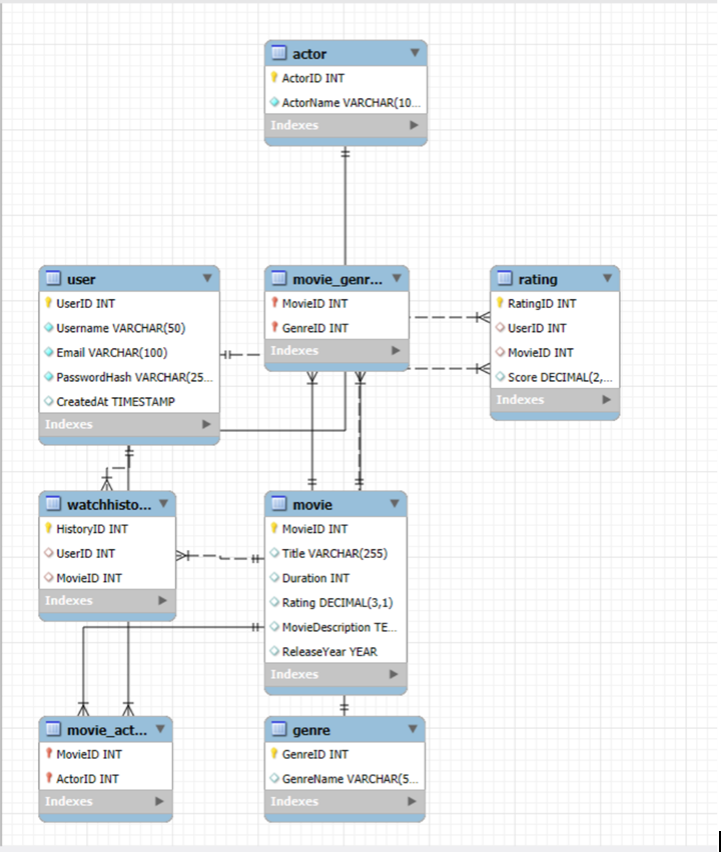

README - Team 7 Movie Streaming Database

This file provides step-by-step instructions for loading and running the Team 7 Movie Streaming Database project for a streaming platform.

FILE EXECUTION ORDER
===========================

Step 1: Create the Database
--------------------------------
Open and execute the following file:
- Create_Database_Team7.sql

This will create the 'moviestreamingdb' database and define all necessary tables and constraints.

Step 2: Populate the Database
----------------------------------
Open the folder named: moviestreamingdb_data_population

Then execute the files in the following order:

1. moviestreamingdb_populate_movies.sql
2. moviestreamingdb_populate_genre.sql
3. moviestreamingdb_populate_movie_genres.sql
4. moviestreamingdb_actor_populate.sql
5. moviestreamingdb_movie_actor_populate.sql
6. moviestreamingdb_populate_user.sql
7. moviestreamingdb_populate_rating.sql
8. moviestreamingdb_populate_watchhistory.sql

Make sure to run them in the exact order above to avoid foreign key errors.

 Step 3: Run Showcase Queries
---------------------------------
Execute:
- Query_Database_Team7.sql

This file includes sample queries that demonstrate database functionality such as:
- Top-rated movies
- Most watched content
- Genre popularity
- Actor participation
- User engagement

===========================

NOTE
===========================
- All scripts are self-contained and should be run on a clean database.

## Tech Stack
===========================
- MySQL
- SQL (Joins, Subqueries, Aggregations)
- ER Modeling
- VS Code, MySQL Workbench

## ER Diagram
The following diagram shows the full database schema:

